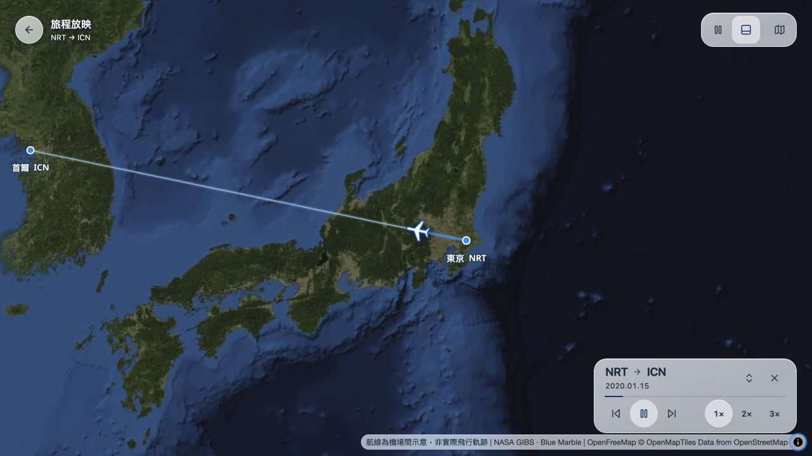

# Flight Log

Turn your flight history into a personal travel map you can replay and keep

[繁體中文](README.md) · [Import guide](docs/GMAIL-IMPORT.md) · [Deploy](docs/SELF-HOST.md)




Replay completed flights with a camera that follows the aircraft. Choose 1×, 2× or 3×, tap the route to search your history, or hide the compact glass controls. Browse a separate flight list and export a travel passport as an image

The screenshots use fictional journeys. Routes estimate airport connections using great circles; they are not recorded flight tracks

## Run locally

Use Node 24. Clone the repository and run these commands. For a ZIP download, enter the extracted folder and start at `nvm use`:

```sh
git clone https://github.com/Hugo6991/flight-log.git
cd flight-log
nvm use
npm ci
npm run setup:local
npm start
```

Open http://127.0.0.1:4173. From the menu, choose the restore action and select `data/example/demo.json` to try fictional flights. The journey player is at `/journey/`. The first setup creates an empty local database and never reads your email

## Add your history

1. Connect your own Gmail account in an AI assistant that supports it, or export selected booking emails yourself
2. Use the prompt in [Gmail import](docs/GMAIL-IMPORT.md) to extract flight segments and flag duplicates, changes and cancellations
3. Validate the JSON with `npm run import:prepare -- data/local/flights.reviewed.json`, review uncertain segments, then restore it in the website
4. Follow [self hosting](docs/SELF-HOST.md) to create your Cloudflare Worker and D1 database

There is no built in Google sign in, inbox integration or background sync. The Gmail workflow currently depends on a separate assistant and your authorization. It cannot recover deleted emails or flights booked through another person's account

## Data and limits

Edits stay in your browser. Export a JSON backup before switching devices or clearing browser storage. A deployed D1 seed is publicly readable; you may instead keep the remote source empty and restore your history only in your own browser. There are no user accounts or automatic device sync

The map requires WebGL and a network connection. OpenFreeMap and NASA GIBS provide map data without an app API key. Their terms and availability are separate from this project's license

This is a personal travel history tool, not live flight tracking, an airline booking service, or an official Flighty product

## Development

```sh
npm run check
npm test
npm run build
```

See [CONTRIBUTING](CONTRIBUTING.md), [SECURITY](SECURITY.md), and [third party notices](THIRD_PARTY_NOTICES.md). Use synthetic data in issues, screenshots and tests

MIT License. The license covers the project's original code, not personal travel records, map services or third party brands
