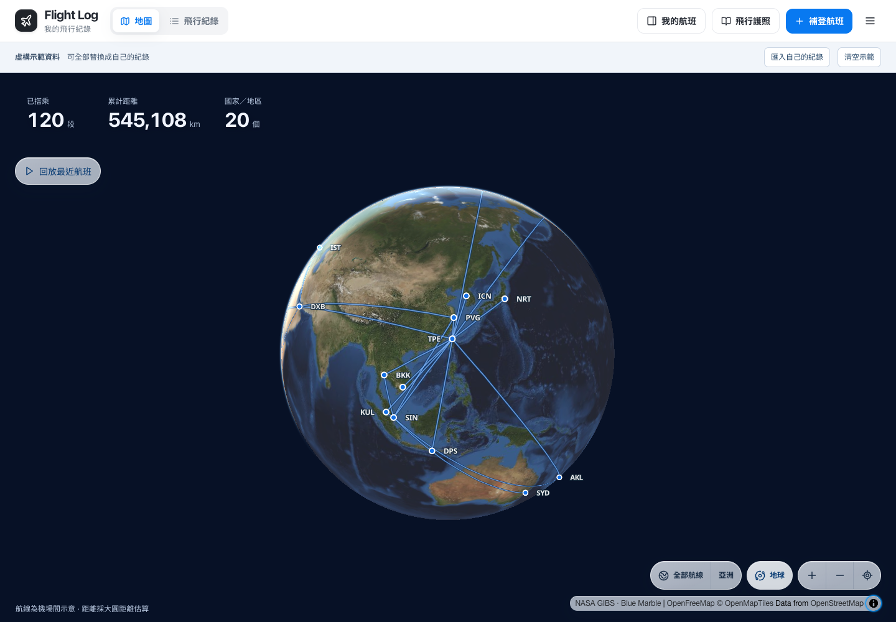
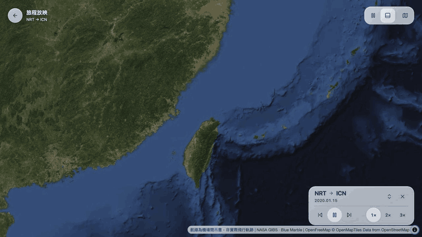

# Flight Log

把歷年航班變成可以回放、收藏與分享的旅行地圖

[線上示範](https://flight-log.vibeencode.dev/) · [旅程放映](https://flight-log.vibeencode.dev/journey/) · [開始使用](#先在本機跑起來) · [English](README.en.md)

免安裝即可瀏覽五年、120 段虛構航班。公開示範站與私人版本分開，所有旅行紀錄都是假資料；匯入或編輯只保存在目前瀏覽器，不會上傳到示範站或影響其他訪客





畫面使用合成示範資料。GIF 來自實際網站錄製，沒有使用 Flighty 的圖片或影片

旅行地圖採 MapLibre、OpenFreeMap 與 NASA 地球影像。旅程放映會自動播放歷史航班，鏡頭跟隨飛機，提供 1×、2×、3×；搜尋城市、機場、日期或班號即可切換。播放與倍速整合成精簡玻璃控制列，點航線即可搜尋切換，也能完全收起

另外有獨立飛行清單、年度／累計護照、補登、更正與 JSON 備份。React / TypeScript / Cloudflare Workers + D1

**這是旅行紀錄工具。沒有即時航班查詢、GPS 航跡、航空公司訂位或自動跨裝置同步。** 非 Flighty 官方產品；不含其程式、圖片、字型或商標素材。

## 四個步驟

1. **下載 GitHub 專案／範本 ZIP。** Node 24，執行下方指令即可先看到五年虛構旅程。
2. **連結自己的 Gmail。** 在支援 Gmail 的 AI 助手中授權，再使用 [Gmail 匯入流程](docs/GMAIL-IMPORT.md) 中的完整提示詞整理 Trip.com 訂單。網站本身不持有 Gmail 權限；目前沒有內建 Google 登入按鈕。
3. **匯入整理結果。** 本機校驗、去重、排除取消、確認搭乘，從網頁備份功能導入。[資料格式](docs/IMPORT-FORMAT.md)
4. **建立自己的網址。** 部署到自己 Cloudflare 帳號的 workers.dev，或接上自己的子網域。[部署步驟](docs/SELF-HOST.md)

## 先在本機跑起來

```sh
git clone https://github.com/Hugo6991/flight-log.git
cd flight-log
nvm use
npm ci
npm run setup:local
npm start
```

若使用 ZIP，進入解壓出的 `flight-log-main` 目錄，從 `nvm use` 開始執行，略過 `git clone` 和 `cd flight-log`。

開啟 http://127.0.0.1:4173 。兩個服務都只監聽本機。setup:local 建立空資料庫，不需要你的郵件或部署帳號。關閉終端機可停止服務。

首次開啟會直接顯示 120 段虛構航班，涵蓋 20 個國家／地區與六洲，以桃園、上海為主要基地。日期固定在 2021 年 9 月 17 日至 2026 年 9 月 16 日，每個年度區間 24 段、每季 6 段。班號與航線有航空公司公開來源，搭乘日期與狀態全部虛構，與作者的旅行紀錄無關。[完整行程與來源](data/example/README.md)

畫面上方選「匯入自己的紀錄」即可用自己的 JSON 整份取代，或選「清空示範」從空白開始。清空後重新整理仍保持空白；混合資料只移除示範航班。匯入和清空前保留一份復原備份，可從「更多功能 → 復原上次還原」取回。匯入自己的資料前仍建議先匯出備份

地圖、飛行清單、旅程放映與護照圖片都會標示虛構資料。已有瀏覽器紀錄時直接使用既有資料，不會自動加入示範；遠端讀取失敗會顯示錯誤。要重新載入示範，可還原 `data/example/demo.json`

## 資料放哪裡

| 資料 | 位置 | 可否提交到 GitHub |
| --- | --- | --- |
| 程式、機場字典、空白／合成範例 | src / shared / public / data/example | 可以 |
| 原始郵件、訂單、票價、匯入校對表 | data/local（已忽略） | 不要 |
| 網頁上的編輯與確認 | 各裝置的 localStorage | 不會自動同步到伺服器 |
| 公開初始航班 | 自己的 D1 | 若匯入則任何訪客可讀取 |

你可以部署**空的公開來源**，只在自己的瀏覽器還原資料，這樣伺服器不存個人行程。若把 seed 匯入遠端 D1，日期、航線、班號即成為公開初始資料；隱藏按鈕或 noindex 不會提供隱私保護。需要登入保護時請另設 Cloudflare Access。

## 開發與貢獻

```sh
npm run check
npm test
npm run build
```

功能更動附測試和手機／桌面檢查；只使用合成資料建立 issue、PR、截圖。不要把郵件、訂位代碼、姓名或 credentials 貼到 issue。

本次示範的[驗證結果與畫面](docs/DEMO-VERIFICATION.md)包含資料完整性、替換與復原、桌面及手機操作

- [參與開發](CONTRIBUTING.md)
- [安全與私人資料](SECURITY.md)
- [操作與資料限制](docs/IMPORT-FORMAT.md)
- [部署與備份](docs/SELF-HOST.md)
- [公開示範站維護](docs/PUBLIC-DEMO.md)
- [Gmail 搜尋和整理提示詞](docs/GMAIL-IMPORT.md)
- [元件／設計參考](docs/DESIGN-REFERENCES.md)
- [第三方資料與授權](THIRD_PARTY_NOTICES.md)

MIT License。原創程式與合成示範資料均可依 MIT 使用及修改；授權不包含你的郵件、個人旅行紀錄、航空公司來源頁面、第三方地圖服務或 Flighty 品牌。


## 功能邊界與下一步

| 現在可以 | 尚未提供 |
| --- | --- |
| 地圖、大圓航線、旅程鏡頭、獨立清單、PNG 護照 | 真實雷達航跡、即時航班追蹤 |
| 合成 JSON 示範、助手整理 Gmail、匯入校驗 | 網站內 Gmail 授權、自動讀信、通用航空公司解析 |
| 各瀏覽器編輯、JSON 備份、自己部署 | 帳戶、跨裝置同步、付費代管 |

此儲存庫是自行部署版本。未完成功能不包含在目前安裝體驗內

## 設計與開源參考

參考 [TripTrail](https://github.com/Fangyuan025/triptrail) 的旅程呈現與影片展示方式、[AirTrail](https://github.com/johanohly/AirTrail) 的資料匯入說明，以及 [Jetlog](https://github.com/pbogre/jetlog) 的安裝與資料隱私說明。未複製上述專案的程式碼；Flighty 是視覺與互動研究參考，並非合作或關聯產品
