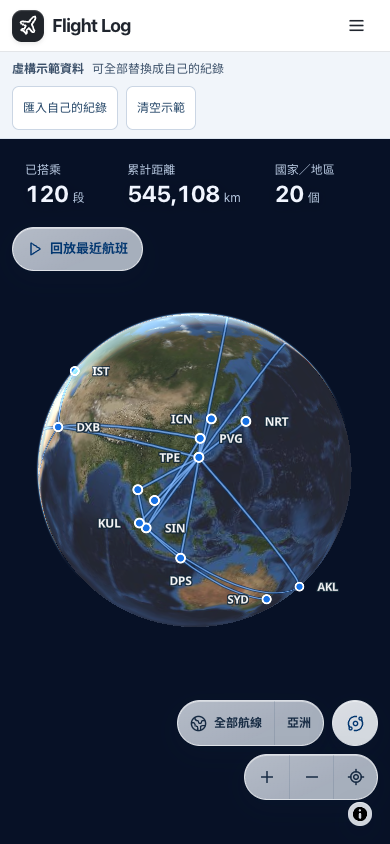

# 五年示範驗證

2026 年 9 月 17 日，在公開儲存庫的獨立分支驗證。測試使用空白本機 D1、乾淨 Chrome 瀏覽器及人工建立的匯入測試資料，沒有讀取個人旅行紀錄，也沒有部署私人版本。

## 資料

| 項目 | 結果 |
| --- | --- |
| 航段 | 120 段，沒有重複的日期、出發、抵達與班號組合 |
| 日期 | 2021-09-17 至 2026-09-16，每個滾動年度 24 段、每季 6 段 |
| 地理涵蓋 | 指定的 20 個國家／地區、六洲，土耳其只計一次 |
| 旅程連續 | 119 次相鄰航段的抵達與下一次出發機場一致，出發日期至少相隔兩天 |
| 主要基地 | 桃園與上海浦東合計出發 51 次 |
| 班號來源 | 48 組有方向的班號與航線，每筆都有航空公司公開來源 |
| 虛構標記 | 每筆保留 demo 來源與虛構備註，出發及抵達時間皆為空白 |
| 重新產生 | 產生器重跑後 demo.json 內容一致 |

來源查證只確認班號與航線的對應，部分依據停飛公告或可檢索的官方班表摘要。沒有宣稱虛構日期實際執飛，也未模擬疫情期間的入境規則。完整查證範圍及各航段來源見[資料說明](../data/example/README.md)。

## 程式檢查

使用 Node 24.18.0 執行下列檢查，全部通過：

```sh
npm run check
npm test
npm run build
```

測試共 13 個檔案、62 項，涵蓋資料格式、地理統計、載入優先序、儲存衝突與既有功能。建置仍有 MapLibre 檔案大小及 Zod 第三方註解提示，沒有型別或建置錯誤。

## 實際瀏覽器操作

共完成 17 組檢查，未出現未捕捉的頁面錯誤。桌面使用 1440 × 1000，手機使用 390 × 844，透過本機 Worker 執行正式建置。

| 操作 | 結果 |
| --- | --- |
| 首次開啟 | 空白來源顯示 120 段，伺服器資料仍為空，瀏覽器不會偷偷寫入示範 |
| 年度、國家與搜尋 | 桌面逐年核對 2021 至 2026；巴西篩選 4 段、EK261 搜尋 2 段；手機年度與班號搜尋亦通過 |
| 整份取代 | 在舊篩選生效時匯入單筆自訂紀錄，示範全部移除、篩選重設；切換回放及復原正常 |
| 無效匯入 | 顯示錯誤，原有 120 段不變 |
| 清空混合資料 | 121 段只移除 120 段示範，自訂紀錄在重新整理後仍存在，復原可取回全部 |
| 保留空白 | 清空純示範後，地圖及放映在重新整理後都保持空白；可復原 |
| 公開來源錯誤 | 地圖與放映都顯示讀取錯誤，不補入示範 |
| 來源優先序 | 非空公開來源優先於示範；已有瀏覽器紀錄時，即使公開來源失效仍可使用 |
| 回放 | 桌面及手機能搜尋、切換至杜拜到聖保羅，3 倍速飛行進度增加，手機可暫停 |
| 護照 | 桌面、手機都實際下載 PNG；純示範與混合資料的標記均保留在圖片內 |
| JSON 備份 | 匯出 120 段，每筆仍有 demo 來源 |
| 手機版面 | 地圖、清單、回放與護照沒有頁面水平溢出，收起回放卡片後仍有虛構標記 |

自訂匯入測試同樣使用人工建立的假資料，不代表任何人的旅行紀錄。回放與地圖依賴外部圖資；本次有實際載入 WebGL 地圖並目視檢查截圖。擷取素材時另修正回放頁的圖資來源展開狀態，使第一次點擊就能顯示署名。

## 展示畫面

[桌面地圖](media/world-map.png) · [旅程回放](media/journey.png) · [實際 GIF 錄影](media/journey.gif) · [護照匯出](media/passport.png)



## 公開部署複驗

2026 年 9 月 17 日將同一份建置部署至 [flight-log.vibeencode.dev](https://flight-log.vibeencode.dev/)，使用獨立的示範 Worker 與空白 D1，既有私人服務的網域綁定保持不變。

正式網址另通過 9 組檢查：未登入可開啟首頁、清單與放映，HTTPS 與安全標頭正常；公開資料來源維持空白並拒絕寫入。桌面實際顯示 120 段與地圖，回放可搜尋並前進，護照能下載。清空、復原及人工自訂資料的整份替換正常，另一個乾淨手機瀏覽器仍顯示完整示範，年度篩選與搜尋亦正常。

Cloudflare 與 Google 公開 DNS 均已解析新子網域。本機曾保留部署前的不存在紀錄快取，因此這次瀏覽器驗證使用公開 DNS 已確認的位址，仍正常驗證 HTTPS 憑證，沒有略過 TLS 檢查。

## Liquid Glass 介面驗證

2026 年 9 月 18 日更新地圖介面，地圖延伸至視窗邊緣，導覽、統計、航班卡片與示範提示改為浮動玻璃面板。航班卡片預設收合備註與操作，展開後保留完整原文及來源

本機瀏覽器以空白來源與虛構資料驗證以下項目

- 1280 × 720 桌面地圖填滿視窗，預設航班卡片約為 320 × 215px
- 390 × 844 與 320 × 740 手機視窗沒有橫向溢出，控制列、回放與航班卡片可操作
- 航班搜尋、展開備註、編輯視窗、護照與飛行紀錄頁正常開啟
- 放映可暫停、開啟航班卡片並搜尋 NZ78
- 清空示範後重新整理保持空白，復原後恢復 120 段
- Escape 關閉示範選單後保留航班卡片
- TypeScript 檢查、62 項測試、正式建置及 Cloudflare 部署預檢通過

## English

The public fixture passed all 62 automated tests, TypeScript checks and the production build. Seventeen browser checks covered first use, data replacement, clearing, undo and failed reads, plus desktop and mobile playback. Passport PNG downloads retained the fictional label, including mixed data. The browser tests used synthetic imports and a separate empty local database. No private installation was modified or deployed.

Screenshots and the eight second recording come from the running application. Airline references establish flight number and route pairs only, not historical operations on the invented dates.
